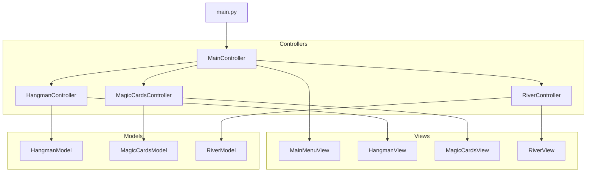

# Arquitectura del Sistema

Este proyecto sigue el patrón de diseño **Modelo-Vista-Controlador (MVC)** para separar la lógica de negocio de la interfaz de usuario.

## Estructura de Directorios

```
mygame/
├── controllers/    # Lógica de control y comunicación
├── models/         # Lógica de negocio y estado del juego
├── views/          # Interfaz de usuario (PySide6 widgets)
├── games/          # Versiones CLI (Legacy)
├── docs/           # Documentación del proyecto
├── main.py         # Punto de entrada de la aplicación
└── styles.py       # Hoja de estilos (CSS para Qt)
```

## Diagrama de Componentes



## Flujo de Datos

1.  **Usuario**: Interactúa con la **Vista** (clics, entrada de texto).
2.  **Vista**: Notifica al **Controlador** sobre la acción.
3.  **Controlador**:
    -   Valida la entrada.
    -   Llama a métodos del **Modelo** para actualizar el estado.
    -   Decide qué vista mostrar o actualizar.
4.  **Modelo**: Procesa la lógica (reglas del juego) y actualiza su estado interno. Devuelve resultados al controlador.
5.  **Controlador**: Solicita a la **Vista** que se actualice con los nuevos datos del Modelo.

## Tecnologías

-   **Lenguaje**: Python 3
-   **GUI**: PySide6 (Qt for Python)
-   **Estilos**: QSS (Qt Style Sheets) definidos en `styles.py`
